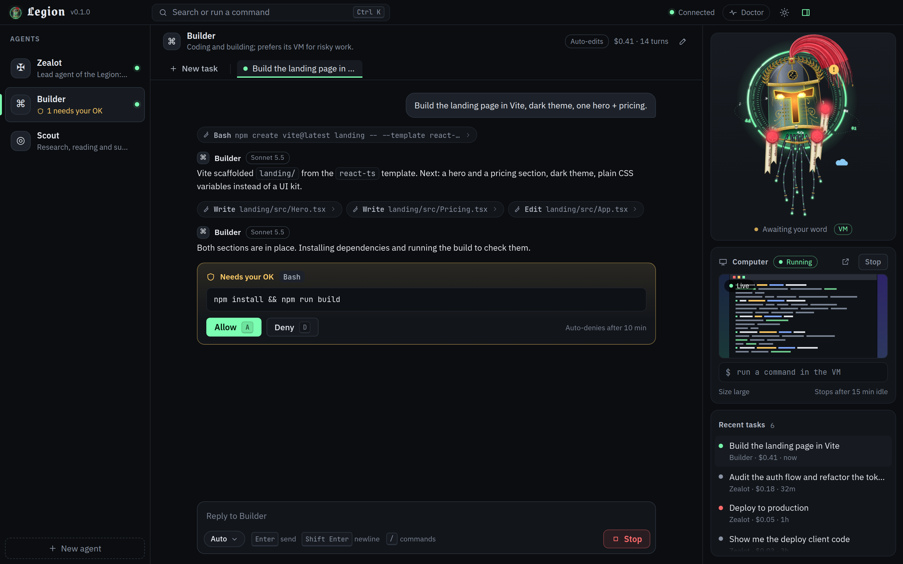
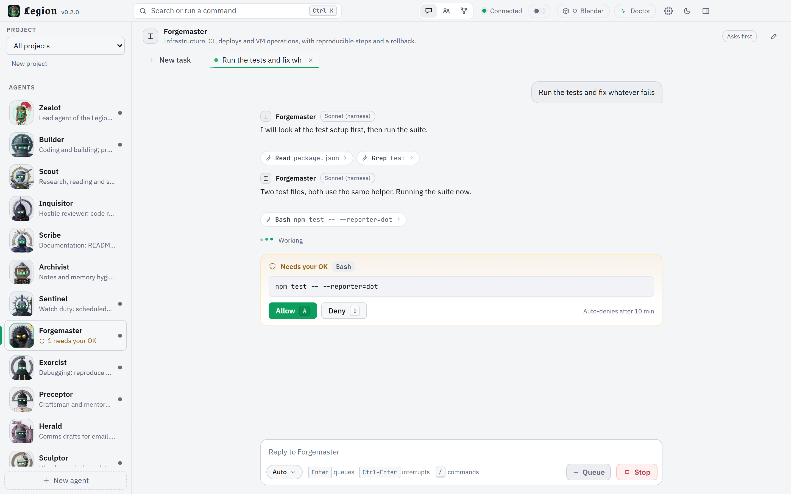
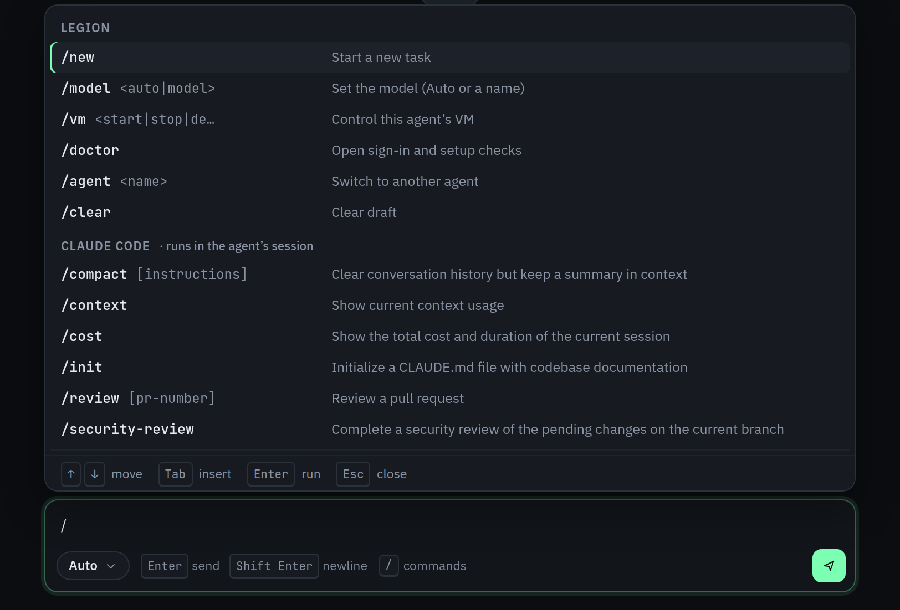
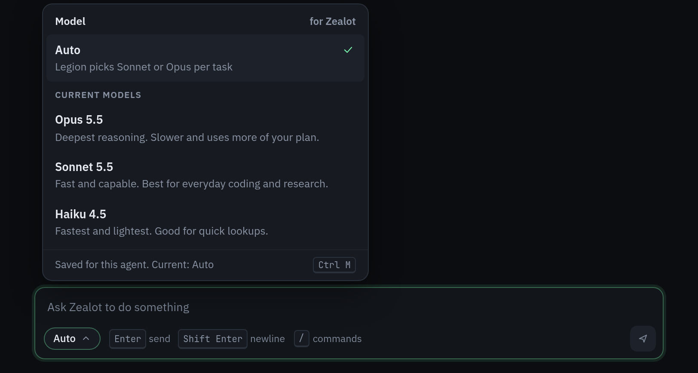

<div align="center">

<p align="center">&nbsp;&nbsp;<picture><source media="(prefers-color-scheme: dark)" srcset="docs/images/legion-wordmark-dark.svg"></picture></p>

**A local multi-agent bot for your desktop — Claude by default, plus OpenRouter for any model — with a VM for every agent when it needs one.**

[Status](#status) · [Install](#install) · [Orchestrate over MCP](#orchestrate-from-claude-code-or-cowork) · [Architecture](docs/ARCHITECTURE.md) · [Contributing](CONTRIBUTING.md)

</div>

## Status

Legion is in beta: expect rough edges and the odd bug. This is the one place for caveats.

- **Releases:** prebuilt Windows releases are on [GitHub Releases](https://github.com/dnh33/legion/releases). A release install updates itself ([Updates](#updates)).
- **Tested:** the automated tests cover the core, app, agents, rooms, Library, board, MCP, approvals, updater and installer.
- **Project board:** in daily use on the maintainer's PC. Screen-reader, display-scale and crash checks are still open.
- **Browser tool:** agents have used it on the maintainer's Windows PC. Web search today goes through Claude's own search tool.
- **BSV mode:** tested against fake wallets only. Mainnet is built and OFF until you switch it on.
- **Blender bridge:** local mode (headless Blender on this computer) and Legion's own managed Blender copy ("Get Blender for Legion") are in use on the maintainer's Windows PC. Cloud VM mode, Live mode (your open Blender through the add-on) and the official extension install are not yet tried on a real Blender.
- **Cloud VMs (boat.dev):** agents have started and used VMs.
- **Installer:** not code-signed and not widely tested. Expect SmartScreen or antivirus prompts.
- **macOS and Linux:** dev install only. The automated tests run on Windows, Linux and macOS in CI; the maintainer uses Windows.
- **Models:** Claude by default, plus OpenRouter with your own key. You can also add an address of your own for any server that speaks the OpenAI chat-completions format, such as vLLM or LM Studio. Presets for OpenAI, Ollama, LM Studio and vLLM, and Codex, are under [Later](#later).

<details><summary>Details</summary>

- The automated tests use no network and no real Claude calls. They cover the core, the app, agents, rooms, the Lattice and Library, Projects with the work board, the browser tool, MCP orchestration, approvals, the updater and the Windows installer scripts.
- BSV mode has a read-only status check of a wallet on this computer, plus one spend tool that asks the wallet to pay only after your confirmations in native dialogs (testnet and mainnet). It is not verified against a real wallet or with real funds yet, until your checks are recorded. Legion has never been pointed at your funded wallet by its own code, tests or agents.
- The installer has not yet run on a wide range of Windows machines. Expect Windows SmartScreen or antivirus prompts for `.cmd` files.
- Updates are a separate matter from the installer: each one is checked against the maintainer's signature before it is applied.
- With OpenRouter, add your own key and run any model. An agent on another provider gets Legion's own tools, not Claude Code's file, shell or web tools; Settings, Providers lists what it cannot do.

</details>

## What it is

Legion runs several Claude agents from one desktop app, on your own machine.

- Each agent has its own persona, model policy, approval mode and working directory.
- An agent can start a cloud VM on [boat.dev](https://boat.dev) when a task needs one.
- Legion uses the Claude Code account you are signed in to: no extra logins or keys.
- Claude Code and Cowork can drive Legion too, over MCP.

<details><summary>Details</summary>

- A small Node service on `127.0.0.1` does the work, and an Electron window sits on top.
- Agents run through the official Claude Agent SDK. Every existing agent runs on a Claude model by default.
- OpenRouter is a second provider: add your own key and run any model. Settings, Providers also takes an address of your own for a server that speaks the OpenAI chat-completions format. Presets for OpenAI, Ollama, LM Studio and vLLM, and Codex, come later (see [Later](#later)).

</details>

<p align="center">
  
</p>

<details>
<summary>Light theme</summary>
<p align="center"></p>
</details>

## Features

**The highlights:** Zealot leads an Order of 13 agents · agents ask each other for help · projects with a work board · shared long-term memory · a cloud VM per agent when a task needs one.

### Your agents

- **13 ready-made agents**: Zealot (lead), Builder (coding), Scout (research) and ten more, or make your own ([The Muster](#the-muster)).
- **Zealot leads the Order.** It splits a request into tasks, hands each to the best agent and runs independent ones at once.
- **Agents talk to each other.** One can `ask` another and wait, or `tell` it and get the reply later.
- **Rooms**: group chats of agents and you ([Rooms](#rooms)).
- **A VM per agent, on demand**, with a live screen preview ([boat.dev VMs](#boatdev-vms)).

<details><summary>Details</summary>

- Your own agents get a name, system prompt, model, approval mode and VM settings. Your edits to Zealot's prompt are kept; the lead role applies on top. In a project, Zealot works through the board's leader.
- Pair threads between two agents resume the same session, so repeat conversations stay cheap. Hop, rate and cycle guards stop runaway loops.
- Rooms have guards against runaway loops. Agents can propose creating a room or changing its members; each change waits for an Allow card that only you can answer in the app.
- Agents start, use and stop their own boat.dev VM. You get an "Open desktop" link. Idle VMs stop on their own, so billing pauses. Legion shows how long a VM has run today, and an optional cost estimate from the hourly price you enter ([docs/VM-NOTES.md](docs/VM-NOTES.md)).

</details>

### Getting work done

- **Projects and a board.** A project groups one job; its board holds the work items the agents pick up ([docs/PROJECT-BOARD.md](docs/PROJECT-BOARD.md)).
- **Talk to a task while it works.** Your message joins the run after the current step ([docs/CHAT.md](docs/CHAT.md)).
- **Live progress** under a running task: turn, tool, time and context in use, plus Claude's own checklist.
- **Continue where it stopped** at the turn limit, after a crash or a restart; the work is kept.
- **Slash commands and a model picker** in the composer ([Slash commands and models](#slash-commands-and-models)).
- **Orchestration over MCP**: drive Legion from Claude Code, Cowork or Claude Desktop ([Orchestrate over MCP](#orchestrate-from-claude-code-or-cowork)).

<details><summary>Details</summary>

- A project holds instructions, a folder, member agents, tasks, rooms and notes. Member agents can create, edit, move, claim and note board items; you mark them done, approve deletes and decide what runs.
- For provider models, Enter queues a message instead (in order, shown above the composer). Ctrl+Enter interrupts the run and sends now. A stop, a failure or a reload pauses the queue instead of sending on its own. Each thread keeps its own half-typed draft, also across restarts.
- A run gets 200 turns by default. One that reaches the limit pauses on the model it was using; **Continue** carries on in the same conversation. A run cut short by a crash, a restart or a dropped connection offers Continue too.
- Claude Code connects over HTTP; Cowork and Claude Desktop connect over a stdio bridge.

</details>

### Memory and context

- **The Lattice and the Library**: a shared knowledge graph the agents use as long-term memory ([Lattice and Library](#lattice-and-library)).
- **The house layer**: rules every agent reads, plus the project's own `AGENTS.md`.
- **Long conversations are compacted, not cut**, and `/compact` does it on demand.
- **Your Claude Code setup, partly inherited**: settings, hooks, skills and slash commands.

<details><summary>Details</summary>

- The Library has an Inbox where you accept or reject what the agents save.
- The house layer holds your house rules, architecture decisions and guidance. A rule file that changes after it shipped is labelled as not approved until you approve it, and an approval lapses when the text changes again.
- Near the model's limit the conversation is compacted, and the thread says when. `/compact` takes an optional focus. A context readout shows how much of the window is in use (an estimate).
- Your Claude Code MCP servers and claude.ai connectors are *not* loaded unless you turn on `claude.inheritMcp`; add the MCP servers you want agents to have in Settings or `config.json`.

</details>

### You stay in control

- **Approval cards** in the thread for risky tool calls; per agent `ask`, `auto-edits` or `full`. Press `A` or `D`.
- **Settings in the app**, applied live: Claude sign-in, your boat.dev key, MCP servers.
- **Doctor** checks your setup and says how to fix what fails ([First run and Doctor](#first-run-and-doctor)).
- **Updates that install**: one click to download, installed when you restart ([Updates](#updates)).

<details><summary>Details</summary>

- Settings covers Claude sign-in or API key, your boat.dev key (with a Test button), MCP servers and connection snippets.
- Doctor checks Node, config, Claude sign-in, boat.dev and the workspace.

</details>

### Costs and limits

- **Auto model routing**: Sonnet or Opus per task, by how hard it looks; or pick any model your account offers.
- **An optional spend limit per run** (Settings, Claude): the run pauses with the work kept.
- **A usage panel** in the title bar: what Claude cost today, over 7 and 30 days, and by model and agent.

<details><summary>Details</summary>

- If Sonnet fails with an error, Opus takes over and finishes the task in the same conversation.
- The usage figures are Claude's own per-task costs, not what a subscription bills.

</details>

### Optional modes

- **BSV mode** (off by default): the Assayer, a BSV knowledge pack, a wallet status check and one spend tool behind native confirmations ([BSV mode](#bsv-mode)).
- **Blender bridge** (off by default): the Sculptor builds 3D scenes in Blender ([docs/BLENDER.md](docs/BLENDER.md)).

<details><summary>Details</summary>

- BSV mode: the wallet check is read-only, for a wallet on this computer. The spend tool asks the wallet to pay only once you have confirmed in native dialogs (testnet and mainnet; mainnet is built and OFF until you switch it on). See [Status](#status) for what is not yet tried for real.
- Blender: headless Blender on this computer by default (in the Sculptor's cloud VM when Blender is not found), or your open Blender after an approval card that shows the whole script. Backends are downloaded only when you press Set up. See [Status](#status) for what is not yet tried for real.

</details>

### The app

- **The Relic**, a hand-painted animated mascot that reacts to what your agents are doing ([The mascot](#the-mascot)).
- **Replies you can reuse**: a copy menu (Markdown or plain text) and real, scrollable tables.
- **Keyboard first**, dark and light themes, a tray icon, and bundled fonts that work offline.

<details><summary>Details</summary>

- Copy as Markdown keeps a table's source; copy as plain text gives tab-separated rows.

</details>

## The Muster

Legion ships with 13 premade agents, each with its own persona, model policy, approval mode and animated bust.

- **The originals:** Zealot (lead), Builder (coding) and Scout (research).
- **They are ordinary agents:** edit their prompts, models and approval modes, or delete the ones you do not want.
- You see 12 until BSV mode is on: the Assayer stays hidden until then.

<details><summary>Details</summary>

The ten that join the originals:

- **Inquisitor**: hostile review and security audit.
- **Scribe**: documentation.
- **Archivist**: notes and memory hygiene; flags, never deletes.
- **Sentinel**: watch duty and alerts.
- **Forgemaster**: infrastructure, CI and deploys.
- **Exorcist**: debugging.
- **Preceptor**: craft and mentoring.
- **Herald**: message drafts; drafts only, never sends.
- **Sculptor**: Blender work through the Blender bridge.
- **Assayer**: BSV development; hidden until BSV mode is on.

</details>

## Rooms

- A room is a group chat of 2 to 6 agents plus you.
- Guards for hops, budget, cycles and `@everyone` stop runaway loops.
- You can freeze and resume a room at any time.

<details><summary>Details</summary>

- Agents can also message each other directly.
- A plain message wakes agents by one of four strategies: mention, manager, round-robin or all.
- An agent that wakes through a room never runs with more freedom than the agent that woke it.
- Text that looks like a seed phrase is refused rather than stored.
- More: [docs/COMMS-BRIDGE.md](docs/COMMS-BRIDGE.md).

</details>

## Lattice and Library

- **The Lattice** is a shared knowledge graph, with `kg_*` tools for every agent and a graph view.
- **The Library** turns it into long-term memory. You accept or reject new notes in the Inbox.
- There are no model calls or embeddings in any of it.

<details><summary>Details</summary>

- The Lattice supports search, neighbours, paths, recall, lint, and Markdown vault import and export.
- Agents capture decisions, mistakes and patterns. Every note carries a trust level.
- Anything an agent writes after touching the web, a shell or an outside tool waits in your Inbox until you accept it.
- More: [docs/KNOWLEDGE-GRAPH.md](docs/KNOWLEDGE-GRAPH.md) and [docs/LIBRARY.md](docs/LIBRARY.md).

</details>

## BSV mode

- **Testing preview.** Tested with fake wallets only, not yet with a real wallet or real funds: use a testnet wallet with test coins. Feedback and ideas are very welcome ([CONTRIBUTING.md](CONTRIBUTING.md)).
- **Off by default.** Turn it on with the BSV switch in the title bar.
- It shows the Assayer, loads a BSV knowledge pack and can check a wallet's status, read-only.
- One spend tool, `bsv_spend_request`: you confirm each payment in native dialogs; whether your wallet asks too depends on the wallet.
- Mainnet ships OFF; only you can turn it on, in the app. Not yet tried for real: see [Status](#status).

<details><summary>Details</summary>

An optional switch in the title bar, off by default. It shows the Assayer bot, loads a read-only BSV knowledge pack into the Lattice (163 notes) and gives the Assayer a short preamble. It can run a read-only status check of a wallet on this computer (four harmless questions to an address you type; the answer is the wallet's own claim). Legion's own code also has one spend tool, `bsv_spend_request`: it asks your wallet to build a transaction, Legion decodes it itself, you read native dialogs (amount, the full address, the network, the fee, the limits left), and only then is the wallet asked to sign; whether the wallet asks too depends on the wallet (see docs/BSV-MODE.md). It works on testnet and on mainnet. **Mainnet is built behind a hard-off switch that ships OFF**: only you turn it on, in the app, and each mainnet spend needs its own Arm and an extra dialog. Limits are tiny by default and per network, the recipient list starts empty, and an outcome Legion cannot confirm blocks every spend until you resolve it. Legion's own code holds no key and does no signing or broadcasting itself. An agent's ordinary tools (a shell, a web fetch) are outside all of this and rest on their approval cards. The Assayer is an ordinary agent: in `ask` mode its shell commands and file edits need your approval, while web fetch and read-only tools run without a prompt. **The spend tool was built and tested against fake wallets only and has not been verified against a real wallet or with real funds until your checks are recorded**; Legion has never been pointed at your funded wallet by its own code, tests or agents. See [docs/BSV-MODE.md](docs/BSV-MODE.md) for what it is and is not.

</details>

## Your Claude subscription, and Anthropic's terms

- Legion uses the account Claude Code is signed in to, through the official [Claude Agent SDK](https://docs.claude.com/en/docs/claude-code/sdk).
- Use it for yourself, on your own machine. Do not host it for other people.
- Anthropic's terms decide what your plan allows. Read them for your plan.
- Legion is an independent project, not affiliated with or endorsed by Anthropic or boat.dev.

<details><summary>Details</summary>

- The default is `claude.auth: "claude-login"`. To pay by API key instead, choose it in Settings, Claude (or set `claude.auth` to `api-key` and provide one). That key is then kept in `config.json`.
- With the default sign-in, Legion's own code never reads, copies or stores your Claude login. It removes `ANTHROPIC_API_KEY` from the child environment, so your login is the one used.
- Do not put Legion behind a shared endpoint, or pass your subscription through it to anyone else.
- Anthropic's terms can change.

</details>

## Requirements

- **A Claude sign-in:** a Claude subscription or an API key. You do not need to install Claude Code: Legion runs the `claude` program that comes with the Claude Agent SDK. To sign in once, run `claude` and type `/login`, or on a release install run `scripts\legion-claude.cmd` and type `/login`.
- **Windows 10/11** is the primary target. macOS and Linux run from a dev install. Caveats: [Status](#status).
- **Node.js 20.10 or newer, for a source install only.** The release package brings its own runtime.
- **Optional:** a [boat.dev](https://boat.dev) account and API key for agent VMs.

<details><summary>Details</summary>

- On Windows, a source install without a usable Node asks once, then downloads a pinned Node LTS into the install folder (no admin, no PATH change).
- CI runs on Node 22.

</details>

## Install

### Windows, from a release (recommended)

1. Download `legion-<version>-win-x64.zip` from the [latest release](https://github.com/dnh33/legion/releases/latest).
2. Unpack it anywhere.
3. Double-click `setup.cmd` in the unpacked folder. It checks the package hash and installs Legion for your user.
4. Launch Legion from a shortcut or with `start-legion.cmd` in the install folder.
5. Optional: right-click Legion on the taskbar and choose **Pin to taskbar**.

This path updates itself ([Updates](#updates)).

**Uninstall (either path):** run `uninstall.cmd` in the install folder. Add `/purge` to delete your data too.

<details><summary>Details</summary>

- Setup installs to `%LOCALAPPDATA%\Programs\Legion`. Use `-InstallDir "D:\Legion"` to choose another folder.
- It adds **Legion** shortcuts on the Desktop and in the Start menu. No admin rights, no Node.js and no build are needed.
- `uninstall.cmd` removes the install folder and the shortcuts. Your data in `%USERPROFILE%\.legion` is kept unless you add `/purge` (you will be asked to confirm).

</details>

### Windows, from source

Clone or unpack the source anywhere, then double-click `setup.cmd`, or run:

```powershell
powershell -ExecutionPolicy Bypass -File scripts\setup.ps1
```

To update, run setup again from a newer source folder.

<details><summary>Details</summary>

- Setup copies the source to the same install folder, installs dependencies, builds the app and adds the shortcuts.
- `-InstallDir "C:\Some\Folder"` installs somewhere else.
- `-DryRun` shows what would happen without changing anything.
- `-Yes` asks no questions: it stops a running Legion, installs and launches. `setup-yes.cmd` does the same from a double-click.
- Setup asks before stopping a running Legion, and stops it by process ID, never by program name.
- It refuses to install over a folder that is not empty and not already a Legion install.

</details>

### macOS and Linux (or any dev install)

```bash
git clone https://github.com/dnh33/legion.git
cd legion
npm ci
npm start          # builds, then opens the desktop app
```

`npm run core` runs the headless core alone, which is enough for the MCP integration.

## Updates

- A release install updates itself: click **Download update**, then **Restart and install**.
- Legion checks GitHub on launch and on a schedule. Turn the check off in Settings, About.
- A git checkout only gets a notice. Update it with `git pull`, `npm ci` and `npm run build`.

<details><summary>Details</summary>

- Legion shows the new version with its notes. The download shows a progress bar, and **Restart and install** shows what will stop before it installs.
- "Install updates automatically when idle" is off by default.
- Legion does not restart while a task, run or approval is live; a ready update waits until Legion is idle.
- Before anything is applied, Legion's own code checks the release against the maintainer's signature, whose public key is built into your copy. It puts the previous version back if the new one does not start.
- The check is one request to github.com. It sees your IP address and the Legion version.
- A non-Windows system or a release that changes dependencies also only gets a notice.
- Details and limits: [docs/UPDATES.md](docs/UPDATES.md).

</details>

## First run and Doctor

- Open **Doctor** in the title bar, or type `/doctor`, to check your setup.
- If sign-in fails, run `claude` in a terminal and use `/login`.

<details><summary>Details</summary>

- On first launch Legion creates `config.json` in its data directory (`%USERPROFILE%\.legion` on Windows, `~/.legion` elsewhere) with a fresh auth token.
- Doctor confirms your Node version, config, Claude sign-in (email and plan, with no model call), boat.dev key and workspace folder. It tells you how to fix anything that fails.

</details>

## boat.dev VMs

VMs are optional. Without a key, agents work locally.

1. Create an API key in the boat.dev dashboard.
2. Paste it in Settings, boat.dev (VMs), and press **Test**. Or put it in `config.json` as `"boat": { "apiKey": "…" }`, or set the `BOAT_API_KEY` environment variable.
3. Optional, for `vm_claude` (Claude Code in the agent's VM): connect your Claude subscription once on boat's **Agents** dashboard.
4. Enable the VM in an agent's settings.

VMs cost money while they run. Legion stops them after 15 idle minutes by default (configurable).

<details><summary>Details</summary>

- The step 3 sign-in goes through Anthropic's own flow, not through Legion.
- Agents get `vm_start`, `vm_exec`, `vm_write_file`, `vm_read_file`, `vm_claude`, `vm_desktop`, `vm_usage` and `vm_stop`.

</details>

## Orchestrate from Claude Code or Cowork

1. Run `npm run mcp-config` (a release install: `scripts\legion-mcp-config.cmd` in the install folder). It prints ready-to-paste snippets with your real token.
2. Paste the snippet for your client (below).
3. Ask, for example: *"Use legion_run with Builder to scaffold the site in its VM, then summarise."*

The MCP token runs and reads agents. Approvals and settings stay in the Legion app window.

**Claude Code** (MCP over HTTP):

```bash
claude mcp add --transport http legion http://127.0.0.1:4747/mcp \
  --header "Authorization: Bearer <token>"
```

**Cowork and Claude Desktop** (stdio bridge), in `claude_desktop_config.json` under `mcpServers`:

```json
"legion": { "command": "node", "args": ["/path/to/legion/dist/src/bin/legion-mcp-stdio.js"] }
```

The bridge starts Legion Core headless if the app is not running. A release install has no system Node: use the snippet that `legion-mcp-config.cmd` prints for it.

<details><summary>Details</summary>

- The MCP token lets Claude Code and Cowork run and read agents, under the `ask` approval ceiling.
- It cannot approve cards, accept Library notes, change settings or change BSV policy. The one BSV call it can make is Freeze, which only stops things.
- Those need the Legion app window, which holds a secret that lives only in memory.
- When Claude Code runs or continues a Legion task, the result ends with one short line, e.g. `Ŧ LEGION · sworn · done`. The answer comes first and is unchanged, and `legion_status` still returns plain JSON.

The MCP tools:

| Tool | What it does |
|---|---|
| `legion_list_agents` | List agents with model, approval mode and VM state. |
| `legion_models` | List the models your account can use. |
| `legion_create_agent` | Create an agent (name, prompt, model, VM). |
| `legion_run` | Give an agent a task; waits for the answer by default. |
| `legion_continue` | Follow up on a finished task in the same session. |
| `legion_status` | Task status, result and recent messages. |
| `legion_cancel` | Cancel a queued or running task. |
| `legion_vm` | Check, start, stop, exec in, see usage of, or get the desktop URL of an agent's VM. |
| `legion_recent_tasks` | List recent tasks. |
| `legion_projects` | List projects, or read one (read only). |
| `legion_board_read` | Read the work items of a project's board (read only). |

</details>

## Slash commands and models

<p align="center">
  
  
</p>

Type `/` in the composer to open the menu. Commands Legion does not handle go to Claude Code unchanged, so your skills, plugins and custom commands work.

| Command | Action |
|---|---|
| `/new` | Start a new task. |
| `/model <auto\|name>` | Set the model for the composer, or for one message if you add text. |
| `/opus`, `/sonnet` | Shorthands for `/model`. |
| `/vm start\|stop\|desktop` | Control this agent's VM. |
| `/compact [focus]` | Compact the conversation, keeping what you name. |
| `/doctor` | Open the setup checks. |
| `/agent <name>` | Switch agent. |
| `/clear` | Clear the draft. |

- **Auto** picks Sonnet for ordinary prompts and Opus for long or hard ones.
- Ctrl+M opens the model picker. The choice is remembered per agent.

<details><summary>Details</summary>

- "Long or hard" means architecture, refactors, debugging, security and similar, or phrases like "think hard".
- When a Sonnet run fails with an error, Opus takes over in the same conversation, unless the error looks like an auth, billing or rate-limit problem.
- Running out of turns is not such an error: the task pauses on its model, so Legion does not move you to Opus prices without asking.

</details>

## Configuration

`config.json` in the data directory. Missing keys fall back to defaults.

| Key | Meaning |
|---|---|
| `port` | Local port. Default `4747`. |
| `authToken` | The MCP-client token. Generated for you; keep it private. |
| `workspaceDir` | Where agent working directories live. Default `<data dir>/workspaces`. |
| `claude.auth` | `claude-login` (default) or `api-key` (with `claude.apiKey`). |
| `claude.inheritClaudeCodeSettings` | Load your Claude Code settings, hooks and CLAUDE.md. Default `true`. |
| `claude.inheritMcp` | Also load your Claude Code MCP servers and connectors. Default `false`. |
| `claude.executablePath` | Path to your own `claude` binary. |
| `claude.maxTurns` | Turn cap per run. Default `200`. |
| `boat.apiKey`, `boat.baseUrl` | boat.dev access. `BOAT_API_KEY` also works. |
| `features.projectBoard` | The project board. Default on; only the literal `false` turns it off. |
| `mcpServers` | Extra MCP servers, in the same shape as Claude Code's `.mcp.json`. |

Environment variables: `LEGION_HOME` (data directory), `LEGION_PORT`, `LEGION_NODE` (Node binary for the app to use), `BOAT_API_KEY`.

<details><summary>Details</summary>

- `authToken` serves the MCP clients (Claude Code, Cowork, curl): `/mcp`, state reads, starting and cancelling tasks, and the event stream. It cannot approve or change settings; the per-launch admin secret that does is never stored. Tasks it starts run under an `ask` ceiling and cannot write working memory or trusted notes.
- `claude-login` uses your Claude Code account.
- `claude.inheritClaudeCodeSettings` covers your user and project settings.
- `claude.inheritMcp` also covers plugins' MCP servers and claude.ai connectors. With the default `false`, a run gets Legion's own server and the servers listed in Settings, MCP servers.
- Without `claude.executablePath`, the `claude` binary bundled with the SDK is used.
- `claude.maxTurns`: a config still on the old default `40` moves to `200` once. A run that hits the cap pauses; **Continue** picks it up in the same conversation.
- `features.projectBoard`: restart Legion after a change. The app does not write this key. See [docs/PROJECT-BOARD.md](docs/PROJECT-BOARD.md).
- `mcpServers`: agents pick servers by name, or `*` for all.
- The data directory holds `config.json`, `state.json`, `messages/`, `workspaces/<agent>/` and `core.log`, among other files.

</details>

## Keyboard shortcuts

| Keys | Action |
|---|---|
| `Ctrl+K` | Command palette |
| `Ctrl+N` | New task |
| `Ctrl+M` | Model picker |
| `Enter` / `Ctrl+Enter` | Send / interrupt the run and send now |
| `F1` / `F2` / `F3` | Chat / Rooms / Library |
| `Ctrl+,` | Open or close Settings |
| `Ctrl+.` | Toggle the Ops panel |
| `Alt+1` to `Alt+9` | Switch agent |
| `A` / `D` | Allow / Deny the focused approval |
| `Ctrl+Shift+M` | Open the mascot lab |

On macOS, use `Cmd` in place of `Ctrl`. While a Claude task works, Enter adds your message to the run; for provider models, Enter queues it.

## The mascot

- The Relic is a hand-painted mascot that reacts to what your agents do.
- Try every expression in the [Expression Lab](docs/demo/relic-lab.html), or the in-app lab (`Ctrl+Shift+M`).
- Click the title-bar glyph three times, or choose "Deus vult" in the command palette, to watch the Legion take over Claude.

<details><summary>Details</summary>

- The Relic is a single hand-painted SVG, split into layers and animated by a small engine.
- It leans in while you type, thinks, hacks, waits for your approval, celebrates, winces at errors, and sleeps when nothing happens.
- To use the Expression Lab, download it and open it in a browser.
- Want to add your own character? The layer format is documented in the [mascot contract](docs/art/MASCOT_CONTRACT.md).

</details>

## Later

Not in v1, and not promised:

- **Presets for OpenAI, Ollama, LM Studio and vLLM.** They show in Settings, Providers as next release. OpenRouter and an address of your own already ship.
- **Codex.** Its command-line agent runs its own shell and file tools outside Legion's approvals, so it is not offered yet.
- **BSV mode beyond one payment:** wallet reads (balances), a VM boundary for wallet tools, and spends by anything other than a run you started.
- A code-signed installer.

<details><summary>Details</summary>

- OpenRouter runs any model, with your own key. Your own address works for any server that speaks the OpenAI chat-completions format.
- The BSV spend tool is built (testnet and mainnet, mainnet behind a hard-off switch); for what is not yet tried for real, see [Status](#status). The maintainer's by-hand checks on a real wallet come next.
- More: [docs/BSV-MODE.md](docs/BSV-MODE.md) and [docs/BSV-WALLET-DESIGN.md](docs/BSV-WALLET-DESIGN.md).

</details>

## Development

```bash
npm ci
npm run typecheck   # TypeScript, core and UI
npm test            # the full suite, no network, no real Claude calls
npm run build       # core to dist/, UI to dist-ui/
npm start           # build and open the app
npm run core        # headless core only
npm run dev:ui      # Vite dev server for the UI on :5173
```

See [CONTRIBUTING.md](CONTRIBUTING.md) for the full workflow and [docs/ARCHITECTURE.md](docs/ARCHITECTURE.md) for how it fits together.

## Project layout

```
src/
  bin/        legion-core (entry point) and legion-mcp-stdio (MCP bridge)
  core/       engine, router, approvals, catalog, VM manager, boat.dev client, store, HTTP server, MCP tools
  electron/   main process and preload
  shared/     types, config, small helpers
ui/           Vite + React renderer, mascot engine, bundled fonts
  dev/        mock server and screenshot scripts
test/         node:test suites
scripts/      Windows installer, icon and mascot builders, MCP config printer
docs/         architecture, comms bridge, Lattice and Library, BSV mode, mascot art and contract, expression lab, README images
assets/       app icon, tray icons, splash
```

## Security

- Agents can run code on your machine. Pick their approval modes deliberately, and use VMs for untrusted work.
- Legion binds to `127.0.0.1` and needs a bearer token on every request except `/health`.
- Approvals, settings, the Library Inbox and BSV need a second secret, kept only in memory.
- Threat model and how to report a vulnerability: [SECURITY.md](SECURITY.md).

<details><summary>Details</summary>

- The second secret means an agent that reads `config.json` cannot approve its own request.
- With the default sign-in, Legion's own code does not handle your Claude login.
- Legion does not stop a process running as your own user from attacking Legion's memory or files, or from calling your BSV wallet directly. Only a VM or a separate OS account does.

</details>

## Contributing

Bug reports, ideas and pull requests are welcome. Start with [CONTRIBUTING.md](CONTRIBUTING.md). Changes are tracked in the [changelog](CHANGELOG.md).

## Licence and credits

Legion is released under the [Apache License 2.0](LICENSE).

Full attribution is in [NOTICE](NOTICE).

<details><summary>Details</summary>

- Design inspiration came from [OpenMausBot](https://github.com/milind-soni/OpenMausBot) (Apache-2.0): bots as contacts, inline approval cards, and a computer panel with a live preview. No code was copied.
- Legion uses the [Claude Agent SDK](https://www.npmjs.com/package/@anthropic-ai/claude-agent-sdk) and the [MCP TypeScript SDK](https://github.com/modelcontextprotocol/typescript-sdk).
- It bundles IBM Plex Sans, JetBrains Mono and Grenze Gotisch under the SIL Open Font License 1.1.

</details>
